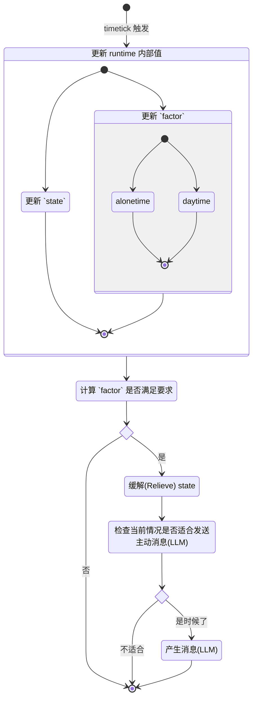

# Runtime

这里的 `runtime` 承担大部分责任，包括调度 triggers，运行内部时钟以及计算主动消息。

尽管我们的 `runtime` 使用 Go 作为开发语言，但我们仍将设计收敛到有限个串行。

它们可以分为两类。

- 第一类是「短事件」，主要执行计算，被放进一条单独的通道中。
- 第二类是「长事件」，它们被放进另一条单独的决策线路。使用串行，通常执行请求 LLM 的决策过程。具有先后性。

如此设计，能够使「长事件」不至于阻碍 `runtime` 内部事件的计算，使整个系统具有稳定性。

---

简短来说，这里有两种在 pipeline 里流动的事件。
- 一种是活跃的事件，它们通常是由外部（包括用户）引发的。
- 另外一种是内部引发的事件，通常是那些被叫做 `initiative message`（主动事件）的部分。  
    主动消息们通常由 `timetick` 引起。
> [!NOTE]
> 有些读者可能会困惑为什么**不是由其他的事件引起**主动消息。  
> 请知悉，那些其他的事件通常影响内部因素，比如当前的 `state` 和 `factor`。  
> 也就是说，它们主要是**间接**影响而非直接。

下面这张图较好地说明了 `timetick` 工作的方式。

如你所见，我们并没有简单地仅用 LLM 来决定是否发送主动消息。相反，在大多数时间内，该 runtime 会有一个预处理环节来计算和判断。

这种方式不仅节约了你的 token，并且也为一个可持续的、长期的 runtime 奠定基础。