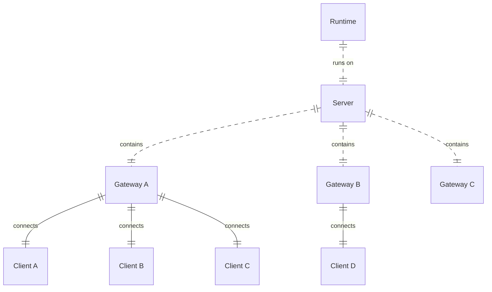

# 关于协议

本节不涉及具体的通信协议实现，仅讨论接口交互所需的数据结构、字段以及语义。

> [!IMPORTANT]
> 当前这部分文档仍处于设计和验证阶段，不可作为生产实践。

## 实例结构

而具体讨论之前，我们希望您了解这个可能存在的实例结构：



即：
- 一个 runtime 与一个 server 共生；
- 一个 server 包含多个**内置**的 gateway；
- 一个 gateway 可连接**任意数量**的 clients。

## 通信内容的种类

对于交互内容，我们可以粗略的划分为两个种类。

- 连接。这部分包含整个连接周期的管理，如 client 发起在 runtime 的注册。
- 交互。此方面多为双向通信，但不保证有回应。

## 通用结构的规定

> [!IMPORTANT]
> 在实际通讯实践中，请注意，**所有字段名（key）**均为小写。  
> 可选字段在该字段后加注 `// optional` 提示。

本节的结构定义仅用于描述数据模型，不限定其具体的传输协议或序列化格式。

所有通信内容均需遵循以下形式：

```
content {
    category: string
    data: object = {
        type: string
        ...
    }
}
```

其中：
 - `category` 是内容的种类，在目前分为 `connection`（连接）和 `interaction`（交互）两种；
 - 而 `data` 则是具体内容，应为类似**字典**的结构，以便于解析。